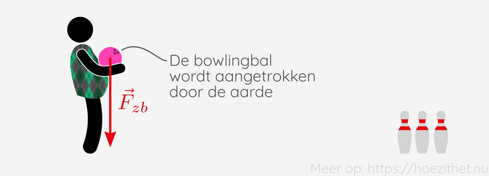
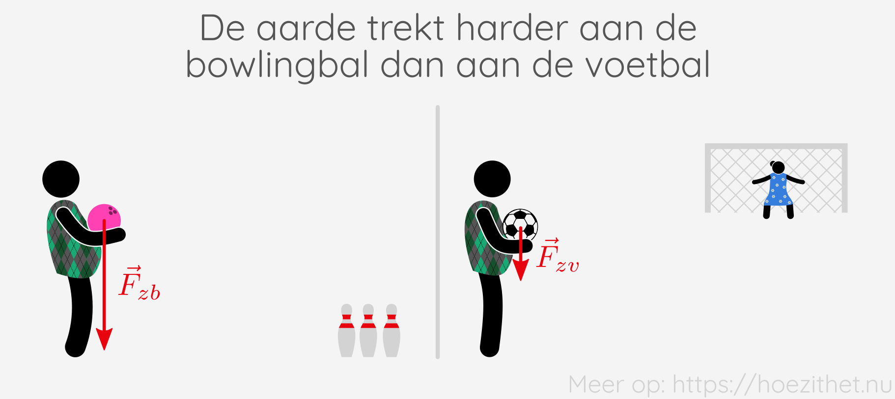
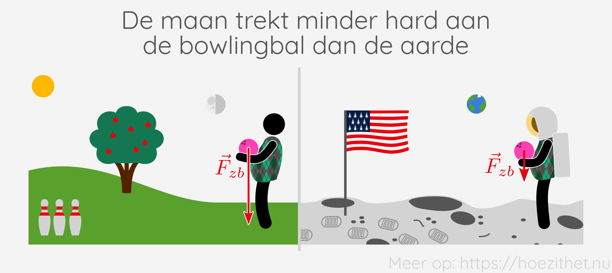
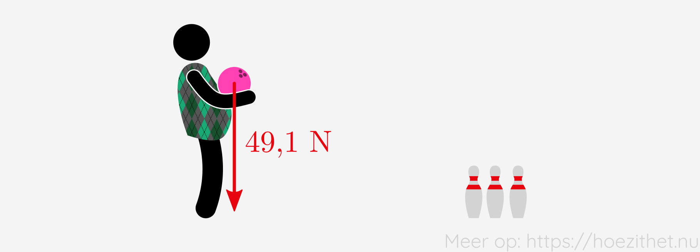
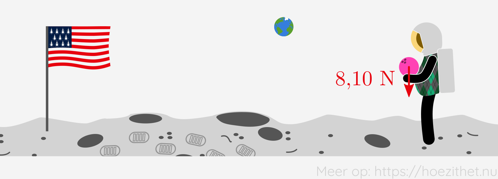
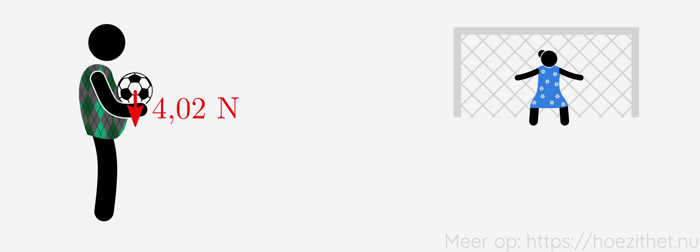

Wanneer je springt, duurt het niet lang voor je terug met beide voetjes op de grond staat. Dat komt door de **zwaartekracht**. De aarde trekt alles naar zich toe. In deze les leren we hoe je de zwaartekracht kan tekenen op voorwerpen en hoe je de grootte ervan kan berekenen.

## De zwaartekrachtsvector $\vec{F}_z$

Zwaartekracht is een kracht en is dus [vectorieel](krachtvector). De zwaartekracht die inwerkt op een bepaald voorwerp $A$, duiden we aan als $\vec{F}_{zA}$.

| Schrijf                | Lees                                   |
| ---------------------- | -------------------------------------- |
| $\vec{F}\_{zA}$        | De zwaartekracht op $A$                |
| $\norm{\vec{F}\_{zA}}$ | De grootte van de zwaartekracht op $A$ |
| $F\_{zA}$              | De grootte van de zwaartekracht op $A$ |

Stel dat Dirk een bowlingbal vasthoudt. De zwaartekracht waarmee de aarde de
bowlingbal naar beneden trekt, duiden we dan aan als $\vec{F}_{zb}$. De
**zwaartekracht wijst altijd recht naar beneden**, meer bepaald naar het
centrum van de aarde.

## Hoe groter de massa, hoe groter de zwaartekracht

Hoe hard de aarde aan een voorwerp trekt, hangt enerzijds af van de **massa**
van dat voorwerp. Als je een bowlingbal vasthoudt, voel je dat die harder naar
beneden getrokken wordt dan wanneer je een voetbal vasthoudt. Dat komt omdat de
massa van een bowlingbal groter is dan de massa van een voetbal.

## Zwaarteveldsterkte

De massa van het voorwerp is niet het enige wat de zwaartekracht bepaalt. Het
hangt er ook van af op welk hemellichaam je staat. Op aarde worden voorwerpen
feller aangetrokken dan op de maan, bijvoorbeeld.

We zeggen dat het zwaarteveld van de aarde sterker is dan het zwaarteveld van
de maan. De **zwaarteveldsterkte** zegt hoe hard er aan
voorwerpen met een bepaalde massa wordt getrokken door de zwaartekracht. Het
symbool voor de zwaarteveldsterkte is $g$ en de eenheid van $g$ is
$\si{N/kg}$. Dat kan je interpreteren als met hoeveel kracht
 een hemellichaam  trekt
aan een massa van één kilogram.

| Grootheid          | Symbool | Eenheid     | Interpretatie                                                          |
| ------------------ | ------- | ----------- | ---------------------------------------------------------------------- |
| Zwaarteveldsterkte | $g$     | $\si{N/kg}$ | Kracht waarmee een hemellichaam trekt aan een voorwerp van $1~\si{kg}$ |

Op aarde zelf varieert de zwaarteveldsterkte een klein beetje. Op de Noordpool
is $g \approx 9{,}83~\si{N/kg}$, terwijl dat op de evenaar ongeveer
$9{,}78~\si{N/kg}$ is.
In België en Nederland, is $g \approx 9{,}81~\si{N/kg}$. We zullen die waarde
voortaan gebruiken voor $g$.

## Grootte van de zwaartekracht

Om de grootte van de zwaartekracht op een voorwerp te berekenen, moet je de
**massa van het voorwerp vermenigvuldigen met de zwaarteveldsterkte**.

$$F_{z} = m \cdot g$$

Stel dat onze bowlingbal een massa heeft van $5{,}00~\si{kg}$. Welke kracht zal
Dirk dan voelen wanneer hij de bal vasthoudt op de aarde? Neem
$g_{aarde}=9{,}81~\si{N/kg}$.

\begin{split}
F\_{zb} &= m_b \cdot g\_{aarde}\\\\\
 &= 5{,}00~\si{kg} \cdot 9{,}81~\si{N/kg}\\\\\
 &= 49{,}1~\si{N}
\end{split}

Dirk gaat nu naar de maan en houdt daar dezelfde bowlingbal vast. Welke kracht
voelt Dirk nu? Neem $g_{maan}=1{,}62~\si{N/kg}$.

\begin{split}
F\_{zb} &= m_b \cdot g\_{maan}\\\\\
 &= 5{,}00~\si{kg} \cdot 1{,}62~\si{N/kg}\\\\\
 &= 8{,}10~\si{N}
\end{split}

De voetbal heeft een massa van $410~\si{g}$. Welke kracht voelt Dirk als hij de
bal vasthoudt op aarde?

\begin{split}
F\_{zv} &= m_v \cdot g\_{aarde}\\\\\
 &= 0{,}410~\si{kg} \cdot 9{,}81~\si{N/kg}\\\\\
 &= 4{,}02~\si{N}
\end{split}

Vergelijk nu eens de zwaartekracht van de voetbal op aarde met de zwaartekracht
van de bowlingbal op de maan. Je ziet dat een bowlingbal op de maan ongeveer
hetzelfde aanvoelt qua gewicht als twee voetballen op aarde.

## Samengevat


De grootte van de zwaartekracht op een voorwerp vind je door de massa van dat
voorwerp te vermenigvuldigen met de zwaarteveldsterkte $g$.

$$F_{z} = m \cdot g$$

Voor situaties op aarde mag je ervan uitgaan dat $g = 9{,}81~\si{N/kg}$.

