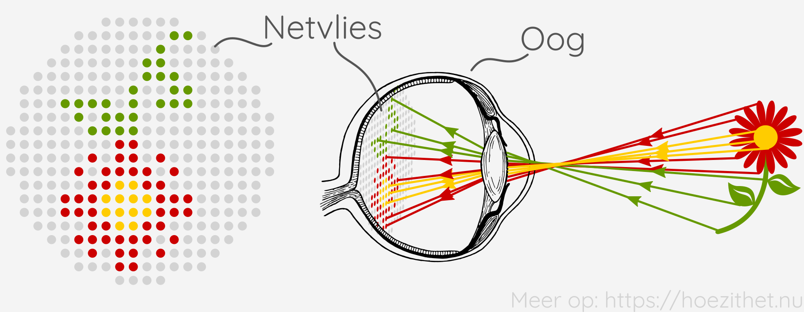
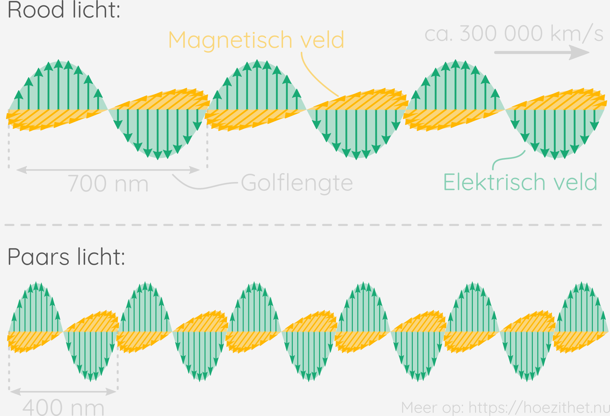
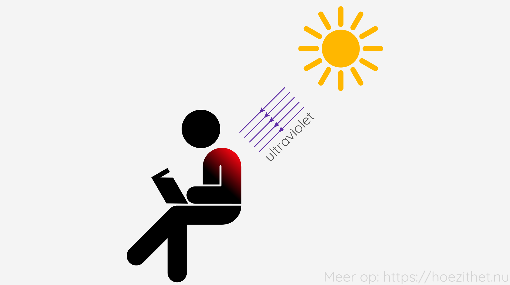
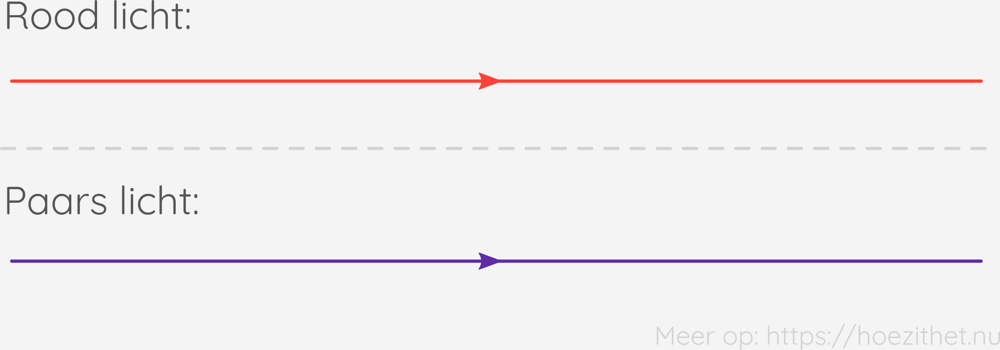

Zonder licht zouden we niets kunnen zien. Licht bestaat uit waanzinnig veel
**lichtstralen** die tegen een duizelingwekkend hoge snelheid vooruit razen.
Elke lichtstraal heeft een bepaalde kleur. Vanaf zulke lichtstralen onze ogen
binnendringen en ergens tegen ons netvlies _botsen_, zien we de kleur die die
lichtstraal had. Omdat er zoveel lichtstralen tegelijk overal op ons netvlies
botsen, zien we voortdurend een hele mozaïek van kleuren.

Er vallen lichtstralen 
in op de bloem en de bloem weerkaatst die. Sommige weerkaatste
lichtstralen komen toevallig in ons oog terecht en botsen daar
op ons netvlies waardoor we de bloem kunnen zien.
Opvallend genoeg, belandt het beeld van de bloem omgekeerd op ons netvlies.
Waarom dat juist zo is, zijn zorgen voor [later](beeldvorming).

## Licht is een elektromagnetische golf

Maar wat _is_ een lichtstraal? Een lichtstraal is eigenlijk een
**elektromagnetische golf** met een golflengte tussen ca. $400 \si{ nm}$ (paars
licht) en $700 \si{ nm}$ (rood licht). Dat zijn veel moeilijke woorden bij
elkaar. Je hoeft ze gelukkig niet allemaal te begrijpen. Dat licht een
elektromagnetische golf is, zal voor ons voorlopig weinig uitmaken.

Het interessante is vooral dat licht niet de enige soort elektromagnetische
golf is. In het dagelijkse leven komen elektromagnetische (em) golven heel vaak
voor. Wifi, bluetooth, radio, gps, gsm en alle andere draadloze communicatie
werkt door em-golven uit te sturen. Het enige verschil tussen licht en
radiosignalen, is dat **de golflengte van radiosignalen veel langer** is. De
golflengte van zichtbaar licht is tussen ca. $400 \si{ nm}$ en $700 \si{ nm} $,
terwijl die bij wifi zo'n $12.5 \si{ cm} $ is, maar liefst $200\ 000$ keer langer.
Als we em-golven met de
golflengte van wifi konden zien, dan zou de wifi-antenne van de router bij jou
thuis licht lijken te geven.

Er bestaan ook em-golven met een **kortere golflengte dan licht**, zoals
ultraviolet en radioactieve straling. Deze golven zijn typisch **schadelijk**
omdat ze door hun korte golflengte met individuele atomen kunnen interageren.
Ze kunnen ongewenste chemische reacties op gang brengen, zoals het beschadigen
van DNA. Als je bijvoorbeeld in de zomer geen zonnecrème smeert, verbrandt je
huid omdat het is blootgesteld aan te veel ultraviolet.

## Lichtstralen tekenen

We zullen vaak de weg tekenen die bepaalde lichtstralen volgen. In zulke
tekeningen stellen we lichtstralen voor als een rechte lijn met een pijl.

